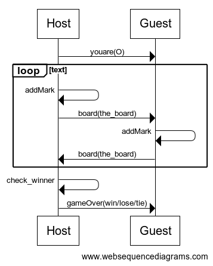

# Règles

Le jeu se joue à deux joueurs et comporte un maitre du jeu joueur.

## Mise en place

Le maitre du jeu est tout le temps X alors que son adversaire est O. Le Maitre du jeu choisit la taille de la grille.

## Déroulé de la partie

Le maitre du jeu commence. Il coche une case, puis transmets le plateau à son adversaire, qui a son tour, coche une case et le renvoie au maitre du jeu.
Le maitre du jeu vérifie si la partie est terminée. Si c'est le cas, il en informe son adversaire.

## Fin de la partie

La partie est terminée lorsqu'aucun des joueurs ne peut plus cocher de cases (égalité ou tie) ou lorsqu'une ligne, colonne ou verticale contient les marques d'un seul joueur, qui est déclaré vainqueur.

# Détail des classes principales

* TicTacToeHost classe exécutable représentant le maitre du jeu
* TicTacToeGuest classe exécutable représentant l'adversaire du maitre du jeu
* TicTacToeStandAlone jeu local.

# Protocole réseau

> Le protocole réseau définit les séquences des commandes échangées entre les différentes parties prenantes. Il doit contenir, pour chaque commande, l'expéditeur, le destinataire, le nom de la commande et le contenu du corps de la commande.

